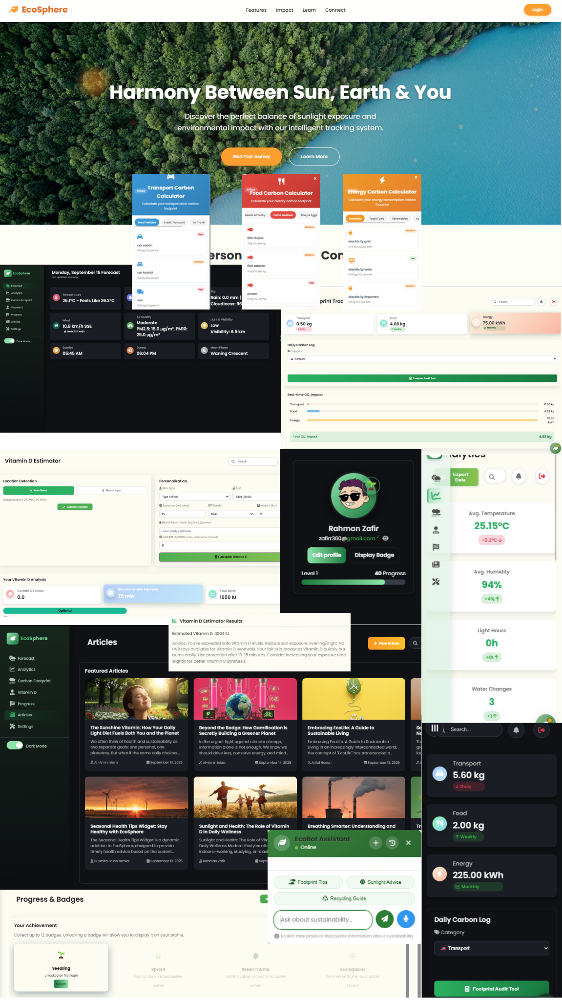

<h1 align="center">🌍 EcoSphere: A Personal Environmental Health & Impact Tracker</h1>

<p align="center">
  <!-- Tech stack badges -->
  
  
  
  
</p>

<p align="center">
  <!-- GitHub repo badges -->
  
  
  
  
</p>

---

<p align="center">
  <!-- Project banner collage -->
  
</p>

---

### 🧠 Abstract
EcoSphere is an innovative web-based platform designed to help individuals monitor their daily environmental impact while improving personal well-being. The system integrates a carbon footprint tracker, real-time CO₂ estimations, and a unique Vitamin D advisor, making environmental awareness a part of daily life. Built using Python (Flask), MySQL, and modern front-end technologies, EcoSphere offers features such as user authentication, gamified ranking systems, real-time analytics dashboards, and location-based weather insights. 

The project's methodology involved a modular development approach across eight weeks, focusing on user-centered design, clean UI/UX, and backend logic for real-time updates. Key goals included promoting eco-conscious habits, simplifying environmental data interpretation, and integrating wellness guidance via sunlight and UV exposure tracking. The platform is functional, visually engaging, and scalable. It addresses real-world needs for sustainability education through gamification and personalization. Overall, EcoSphere bridges the gap between digital innovation and sustainable living in a way that's interactive, educational, and user-friendly.

---

### 💡 Introduction

---

Background & Motivation

EcoSphere tackles two intertwined challenges of modern living: the environmental burden of daily choices and the health consequences of inadequate or excessive sun exposure. Transportation, food, and energy consumption account for a significant share of anthropogenic greenhouse gas emissions, while over one billion people globally suffer from vitamin D insufficiency due to limited or unsafe sunlight exposure.

By combining sustainability and personal wellness in one responsive platform, EcoSphere empowers individuals to:

- Track their carbon footprint across transport, food, and energy.
- Receive personalized vitamin D recommendations based on geolocation, UV index, and skin type.
- Learn actionable insights to reduce emissions while improving health.

---

Goals & Objectives

- EcoSphere is designed to:
- Log emissions across transportation, diet, and energy with tailored tracking.
- Provide safe sunlight exposure guidance using dermatological typology and real-time UV index.
- Deliver analytics and trends to help users monitor progress and build sustainable habits.
- Maintain high usability and reliability, with cross-device responsiveness and strong data integrity.

---

Challenges: 

* Existing health apps: focus on physiological metrics, ignoring environmental impacts.
* Carbon calculators: offer generalized, non-personalized estimations.

EcoSphere fills this gap with an integrated framework that combines sustainability and health optimization.

---

Methodology & Calculations:

Equation 1: Carbon Footprint
<h align="center"><CO₂e = Activity Quantity × Emission Coefficient></h>

Equation 2: Vitamin D Yield
<h align="center"><CO₂e = Vitamin D (IU) ≈ Exposure Duration (minutes) × UV Index × Skin Factor × 40></h>
<h align="center"><CO₂e = VitaminD = (UV_Index × Exposure_Time × Skin_Factor × 10) × (70 / Weight) × Serum_Factor × Age_Factor></h>

- Skin Factor ranges from 1.0 (Type I) to 0.25 (Type VI).
- Calibrated to yield approximately 1,000 IU for optimal exposure.

---

### Backend Data Tables

Transport Emission Factors

| Category              | Subtype            | Emission Factor (kg CO₂/km) | Impact Level |
| --------------------- | ------------------ | --------------------------- | ------------ |
| **Road Vehicles**     | Car (Sedan)        | 0.21                        | Medium       |
|                       | Car (Hybrid)       | 0.12                        | Medium       |
|                       | SUV                | 0.29                        | High         |
|                       | Pickup             | 0.35                        | High         |
|                       | Motorcycle         | 0.15                        | Medium       |
| **Public Transport**  | Bus (Local)        | 0.05                        | Low          |
|                       | Bus (AC)           | 0.09                        | Medium       |
|                       | Train (Local)      | 0.04                        | Low          |
|                       | Train (Intercity)  | 0.03                        | Low          |
|                       | Metro              | 0.03                        | Low          |
| **Air Travel**        | Plane (Domestic)   | 0.18                        | High         |
|                       | Plane (Short-haul) | 0.20                        | High         |
|                       | Plane (Long-haul)  | 0.25                        | High         |
| **Alternative Modes** | Bicycle            | 0.00                        | Low          |
|                       | Walking            | 0.00                        | Low          |
|                       | Electric Rickshaw  | 0.03                        | Low          |
|                       | Uber (Car)         | 0.22                        | High         |

---

Energy Emission Factors

| Category         | Subtype              | Emission Factor (kg CO₂/unit) | Unit | Impact Level |
| ---------------- | -------------------- | ----------------------------- | ---- | ------------ |
| **Electricity**  | Grid Electricity     | 0.75                          | kWh  | Medium       |
|                  | Solar Electricity    | 0.05                          | kWh  | Low          |
|                  | Imported Electricity | 0.60                          | kWh  | Medium       |
| **Fossil Fuels** | Diesel               | 2.70                          | L    | High         |
|                  | Petrol               | 2.30                          | L    | High         |
|                  | Natural Gas          | 2.00                          | m³   | High         |
|                  | LPG                  | 2.98                          | kg   | High         |
| **Renewables**   | Biomass              | 1.10                          | kg   | Medium       |
|                  | Biogas               | 0.20                          | m³   | Low          |
|                  | Solar Water Heater   | 0.03                          | kWh  | Low          |
| **Appliances**   | Air Conditioner      | 0.75                          | hour | Medium       |
|                  | Refrigerator         | 0.65                          | hour | Medium       |
|                  | Fan                  | 0.20                          | hour | Low          |
|                  | LED Light            | 0.10                          | hour | Low          |

---

Food Emission Factors

| Category | Subtype    | Emission Factor (kg CO₂/kg) |
| -------- | ---------- | --------------------------- |
| Food     | Beef       | 60.0                        |
|          | Vegetables | 1.0                         |

---

### ✨ Key Features

1. Daily Carbon Footprint Logging
Users can log their daily activities across three categories: transportation, energy usage, and food habits. Each input contributes to an individual's carbon emission profile.

2. Real-Time CO₂ Impact Calculation
Emission models calculate the user's daily, weekly, and cumulative CO₂ impact instantly. Calculations use publicly available emission factors to approximate environmental footprint.

3. Vitamin D Estimator
Uses the user's location, UV index, and sunlight exposure to estimate daily Vitamin D levels, promoting better health awareness in relation to geography and time of year.

4. Authentication
Users can now create an account using their name, email, and password. Upon successful creation, data is securely stored in the database, and users can log in with those credentials anytime.
To simulate email verification without third-party services, a 6-digit code is generated and shown immediately after registration in a modal. The user must input this code to complete the verification process. This ensures authenticity while remaining cost-free.
Users can also choose the guest login option, which auto-generates a profile such as Guest_748291. This allows quick entry without registration. Guest profiles are temporary and fully deleted on logout, suitable for demo or test usage.

5. Avatar Customization & Profile Editing
Users can choose from 6 predefined eco-themed avatars (via DiceBear) and edit their name. Profile personalization enhances user engagement and identification.

6. Gamified Rank Progress System
o	Ranks from 1 to 10 with progress reset to 0/100 upon each level-up.
o	First 1–2 ranks are unlocked quickly to demonstrate badge visibility.
o	Later ranks grow slower via real activity-based achievements.
o	Custom badges dynamically appear on the avatar when unlocked, with animations.

7. Progress Tracking & Visualization
Dashboard and Progress Page display real-time user stats using visual bars. Progress is broken down into:
o	Eco Habits
o	Energy Efficiency
o	Water Conservation
o	Sustainable Living

8. Articles & Personal Wellbeing Tips
Users can post, read, and interact with articles covering personal wellbeing, sustainable living, and motivation. This feature encourages community engagement and knowledge sharing to promote healthier and more eco-conscious lifestyles.

9. Interactive Dashboard
Presents weather-based insights (temperature, humidity, UV index) using the user's geolocation. If location access is denied, displays "No Data".

10. Location-Enabled Weather & Vitamin D API Logic
Uses geolocation on login to fetch environmental data. Also includes manually selected country/city options for Vitamin D estimates if user denies geolocation.

11.	Responsive UI with Modal Logic
All forms (login, profile editing, verification) use modal popups for seamless UI/UX. Includes checkbox validation, animations, and clean CSS design.

12. Responsive Dashboard
EcoSphere’s dashboard is fully responsive, ensuring a seamless user experience on desktops, tablets, and mobile devices. Users can access all features and visualize their carbon footprint, vitamin D exposure, and progress anywhere, anytime.
---

### 🔧 Tech Stack Overview

| Category            | Tools Used                                                                                                                                                                                                                                                           | Description                                                                 |
| ------------------- | -------------------------------------------------------------------------------------------------------------------------------------------------------------------------------------------------------------------------------------------------------------------- | --------------------------------------------------------------------------- |
| **Language**        |  Python                                                                                                                                                                                | Backend programming for logic, calculations, and API integration.           |
| **Framework**       |  Flask                                                                                                                                                                                 | Web framework to build server routes, templates, and backend functionality. |
| **Frontend**        |  HTML<br> CSS<br> JavaScript | Build responsive UI, interactive dashboards, and client-side logic.         |
| **Database**        |  MySQL                                                                                                                                                                               | Store users, logs, articles, and other structured data.                     |
| **APIs**            |  OpenWeather<br> OpenUV
                                                                         | Fetch live weather and UV data for calculations and insights.               |
| **Data Libraries**  |  Pandas<br> NumPy                                                        | Perform numerical computations, data manipulation, and analytics.           |
| **Template Engine** |  Jinja2                                                                                                                                                                                    | Render dynamic HTML templates for Flask routes.                             |
| **Version Control** |  Git<br> GitHub                                                                                                       | Track code changes and manage collaborative development.                    |

---

### 📁 Project Structure

```
ecosphere/
├── app/
│ ├── routes/
│ │ ├── init.py
│ │ ├── article.py
│ │ ├── auth.py
│ │ ├── carbon.py
│ │ ├── comments.py
│ │ ├── dashboard.py
│ │ ├── env.py
│ │ ├── main.py
│ │ ├── notes.py
│ │ ├── notifications.py
│ │ ├── progress.py
│ │ ├── users.py
│ │ └── vitamin.py
│ │
│ ├── static/
│ │ ├── css/
│ │ │ └── dashboard.css
│ │ ├── js/
│ │ │ ├── analytics.js
│ │ │ ├── carbon.js
│ │ │ ├── dashboard.js
│ │ │ ├── sunrise-sunset.js
│ │ │ ├── vitamin.js
│ │ │ ├── weather.js
│ │ │ └── weather_extensions.js
│ │ └── uploads/
│ │
│ ├── templates/
│ │ ├── dashboard.html
│ │ ├── energy.html
│ │ ├── food.html
│ │ ├── index.html
│ │ └── transport.html
│ │
│ ├── init.py
│ └── models.py
│
├── instance/
│
├── migrations/
│
├── .gitignore
├── config.py
├── ecosphere_schema.sql
├── init_db.py
├── requirements.txt
└── run.py
```

---

### ⚡ Installation

1. Clone the repository

```
git clone https://github.com/alaminO8islam/ecosphere.git
cd ecosphere
```
2. Set up a Python virtual environment
```
python -m venv venv
# Activate environment
# Windows
venv\Scripts\activate
# macOS/Linux
source venv/bin/activate

```
3. Install dependencies
```
pip install -r requirements.txt
```
4. pip install -r requirements.txt
- Create a MySQL database
- Import the schema:
```
mysql -u your_user -p ecosphere < ecosphere_schema.sql
```
5. Run the application
```
python run.py
```
- Visit http://127.0.0.1:5000 in your browser.
- The app is fully responsive on desktop and mobile.
---

### 🚀 Roadmap

EcoSphere’s development vision is ambitious and user-centric:
- EcoBot AI: A personalized EcoSphere chatbot to guide users and answer sustainability or wellness queries.
- Real-Time Communicating: Platform for users to communicate via text, images, voice, and audio.
- Enhanced Wellbeing Initiatives: Nature-focused features promoting ecological conservation and personal health.
- Advanced Articles & Progress Tracking: Gamification and analytics for a next-level user experience.
- Continuous UI/UX improvements to make EcoSphere immersive, intuitive, and modern.

---

### 👥 Contributors

- Al-Amin Islam (Lead Developer)
- Ariful Hasan Pranta [](https://github.com/Prantasky)  
- Susmita Falan Ramlal [](https://github.com/Susmitasarker1)  

How to contribute:
1. Fork the repository.
2. Create a feature branch.
3. Push to your branch.
4. Open a Pull Request and describe your improvements.

---

### 📜 License

### License

This project is licensed under the **[GNU General Public License v3.0](https://www.gnu.org/licenses/gpl-3.0.en.html)** (GPL-3.0).
---


